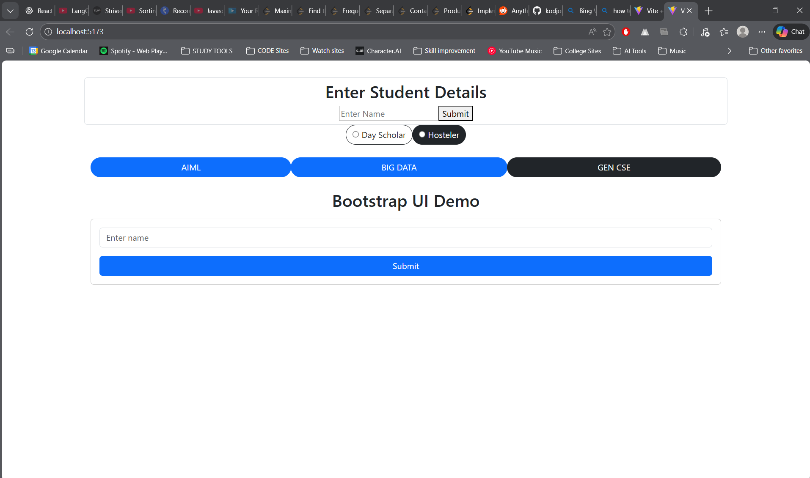

# Bootstrap UI Experiment

## Project Description
This experiment demonstrates the use of **Bootstrap components** inside a **React application**.  
It includes form inputs, buttons, button groups, radio buttons, and card layouts to build a simple user interface for collecting student details.

---

## Technologies Used
- React (Vite)
- Bootstrap 5
- HTML
- CSS

---

## Project Structure
Bootstrap/
│
├── src/
│   ├── App.jsx
│   ├── App.css
│   └── assets/
│       ├── react.svg
│       └── vite.svg
│
├── index.html
├── README.md
└── package.json

---

## Installation Steps
1. Open terminal in the project folder
2. Install dependencies  
   npm install
3. Install Bootstrap  
   npm install bootstrap
4. Start the development server  
   npm run dev

---

## Features Implemented
- Student input form
- Bootstrap styled submit buttons
- Radio button toggle group
- Button group for department selection
- Card layout with form controls
- Responsive Bootstrap design

---

## Code Explanation
- `form-control` is used for styled input fields.
- `btn` classes are used for buttons with different styles.
- `btn-group` is used for grouping radio buttons and options.
- Bootstrap utility classes like `mt-4`, `container`, and `container-fluid` are used for spacing and layout.
- Card component is used to organize form elements.

---

## Output / Evidence
The screenshot below shows the output of the Bootstrap UI experiment:

---

## Conclusion
This experiment successfully demonstrates how Bootstrap components can be integrated into a React application to create responsive and interactive user interfaces with minimal custom CSS.

---

## Author
Kavya
