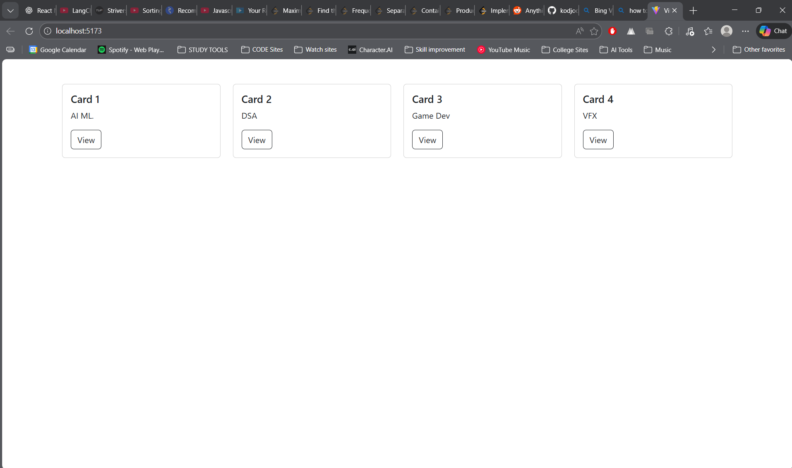

# React Bootstrap Card Layout

## Project Description
This project demonstrates a **responsive card layout** built using **React** and **Bootstrap**.  
Four cards are displayed in a single row on medium and larger screens, each representing a different domain with a title, description, and action button.

---

## Technologies Used
- React (Vite)
- Bootstrap 5
- CSS

---

## Project Structure
Card/
│
├── src/
│   ├── App.jsx
│   ├── App.css
│   └── assets/
│       └── react.svg
│
├── image.png
├── README.md
└── package.json

---

## Installation Steps
1. Open terminal in the project folder
2. Install dependencies
   npm install
3. Install Bootstrap
   npm install bootstrap
4. Start the development server
   npm run dev

---

## Features
- Responsive Bootstrap grid system
- Four-card layout using Bootstrap cards
- Clean and minimal UI
- Outline style buttons
- Mobile-friendly design

---

## Code Explanation
- `container` and `row` classes are used for layout structure.
- `col-md-3` ensures four cards per row on medium and larger screens.
- `card` and `card-body` create structured card components.
- Bootstrap buttons are used for actions.

---

## Output Screenshot
The image below shows the output of the card layout:

---

## Conclusion
This experiment demonstrates how Bootstrap card components and grid layout can be used within a React application to build responsive and visually organized content sections.

---

## Author
Kavya
