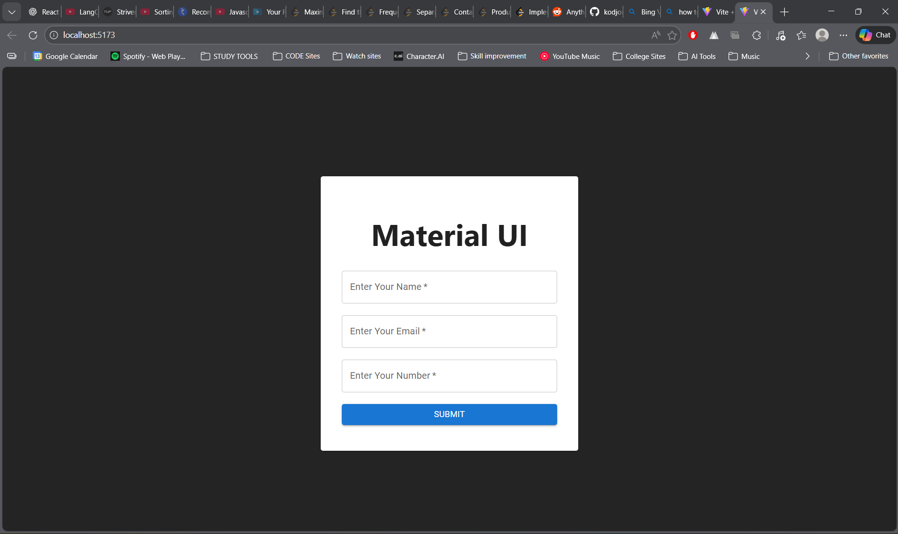

# React Material UI Form

## Project Description
This project demonstrates a simple **form UI** built using **React** and **Material UI (MUI)**.  
It includes text fields for user input and a submit button, all wrapped inside a Material UI Card component.

---

## Technologies Used
- React (Vite)
- Material UI (MUI)
- CSS

---

## Project Structure
MaterialUI/
│
├── src/
│   ├── App.jsx
│   ├── App.css
│   └── assets/
│       └── react.svg
│
├── image.png
├── README.md
└── package.json

---

## Installation Steps
1. Open terminal in the project folder
2. Install required dependencies
   npm install
3. Install Material UI
   npm install @mui/material @emotion/react @emotion/styled
4. Start the development server
   npm run dev

---

## Features
- Material UI Card layout
- Text fields with validation
- Responsive form design
- Material UI styled submit button
- Clean and minimal UI

---

## Code Explanation
- `Card` and `CardContent` are used for layout.
- `TextField` components are used for input fields.
- `Button` component is used for form submission.
- Inline styling is applied for spacing and alignment.

---

## Output Screenshot
The image below shows the output of the Material UI form:

---

## Conclusion
This experiment demonstrates how Material UI components can be used in a React application to create a clean, responsive, and professional-looking form interface.

---

## Author
Kavya
