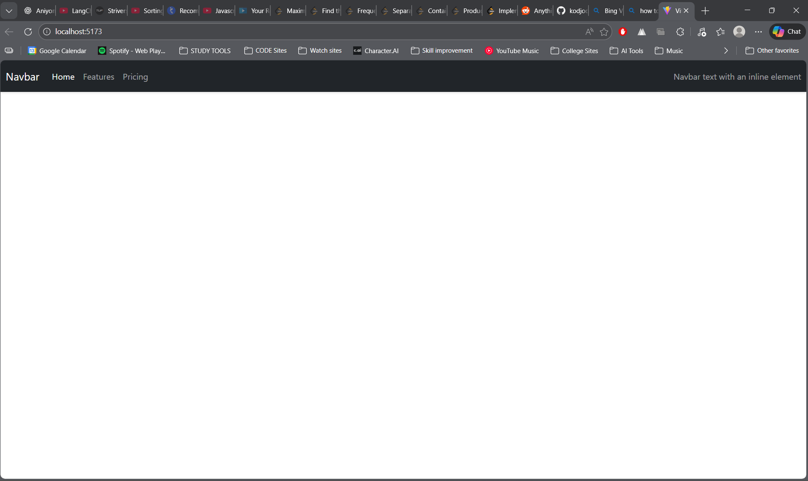

# React Bootstrap Navbar

## Project Description
This project demonstrates a responsive navigation bar created using React and Bootstrap 5.  
The navbar includes a brand name, navigation links, a toggle button for smaller screens, and text aligned on the right side.

---

## Technologies Used
- React (Vite)
- Bootstrap 5
- CSS

---

## Project Structure
navbar/
│
├── src/
│   ├── App.jsx
│   ├── App.css
│
├── image.png
├── README.md
└── package.json

---

## Installation Steps
1. Open terminal in project folder
2. Install dependencies
   npm install
3. Start the development server
   npm run dev

---

## Features
- Responsive Bootstrap navbar
- Collapsible menu for mobile view
- Dark themed navigation bar
- Implemented using React functional component

---

## Code Explanation
- Bootstrap CSS and JS are imported in the React app.
- `navbar-expand-lg` makes the navbar responsive.
- `collapse navbar-collapse` enables toggling on small screens.
- Navigation links are created using Bootstrap classes.

---

## Output Screenshot
The image below shows the output of the navbar:

---

## Conclusion
This experiment demonstrates how Bootstrap components can be integrated into a React application to create responsive UI elements efficiently.

---

## Author
Kavya
