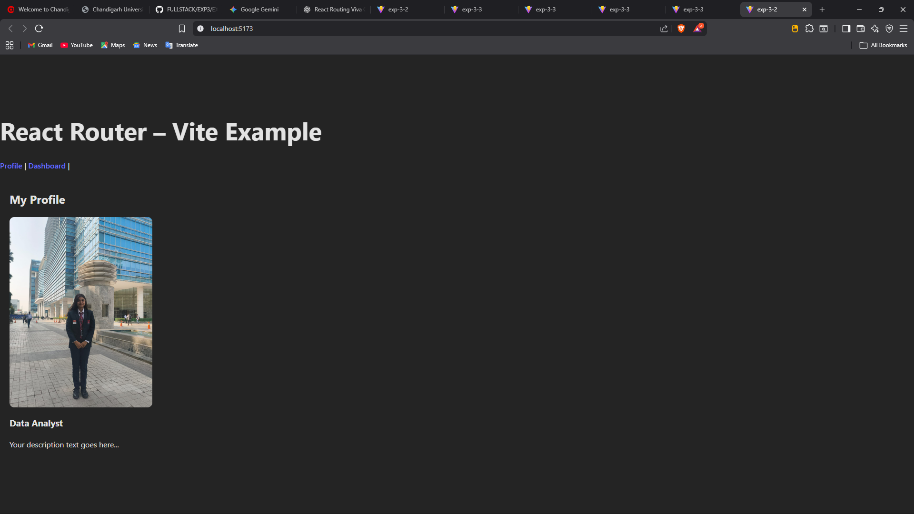

# Multi-Page React App with Button Navigation

## Overview

This is a React single-page application (SPA) that uses React Router to create a multi-page experience with button-based navigation. The app features a Profile page and a Dashboard page with seamless navigation between them.

## Features

- ⚡ Built with React + Vite for fast development
- 🧭 React Router DOM for client-side routing
- 🎨 Custom styled components
- 🔘 Button-based navigation between pages
- 📱 Responsive design
- 👤 Profile page with personal information
- 📊 Dashboard page with analytics

## Demo



## Project Structure

```
multiSPAbutton/
├── src/
│   ├── components/
│   │   └── Header.jsx
│   ├── pages/
│   │   ├── Profile.jsx
│   │   └── Dashboard.jsx
│   ├── assets/
│   ├── App.jsx
│   ├── main.jsx
│   └── index.css
├── public/
└── package.json
```

## Installation

1. Install dependencies:

```bash
npm install
```

2. Run the development server:

```bash
npm run dev
```

3. Open your browser and navigate to `http://localhost:5173`

## Technologies Used

- React 18
- React Router DOM
- Vite
- CSS3