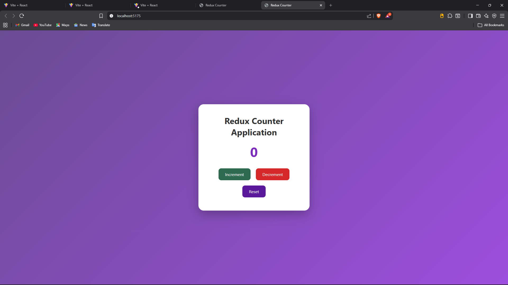
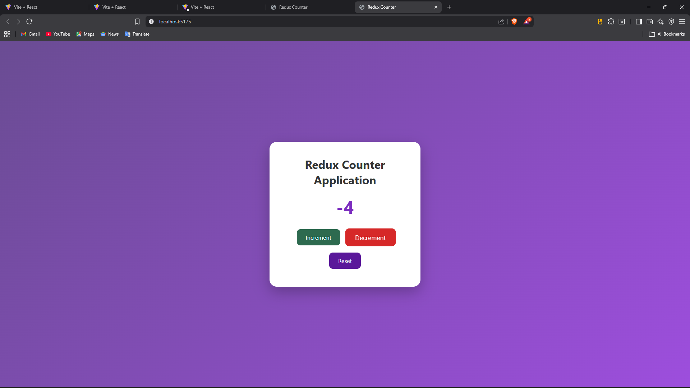

# Redux Counter Application

## 📌 Experiment-2: State Management Using Redux (Counter Application)

---

## 🎯 Aim
To implement centralized state management using Redux Toolkit in a React application by creating a counter app.

---

## 🧰 Software Requirements
- Node.js  
- React (Vite)  
- Redux Toolkit  
- React-Redux  

---

## 📚 Theory
Redux is a predictable state container for JavaScript applications.  
It stores the entire application state in a single global store and updates it using actions and reducers.  
Redux Toolkit simplifies Redux usage by reducing boilerplate code and providing built-in utilities like `createSlice` and `configureStore`.

---

## 🧩 Features
- Increment counter value  
- Decrement counter value  
- Reset counter to zero  
- Centralized state using Redux Toolkit  
- Clean and modern UI  
- Animated and centered card layout  

---
## demo

## 🗂️ Folder Structure
src
┣ redux
┃ ┣ counterSlice.js
┃ ┗ store.js
┣ App.jsx
┣ App.css
┣ main.jsx
┣ index.css
index.html
package.json
README.md