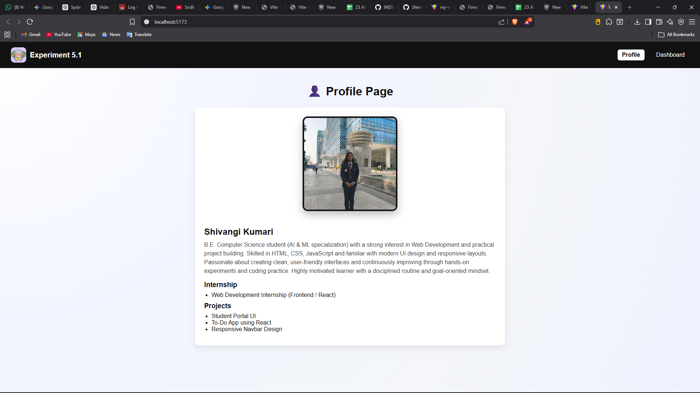
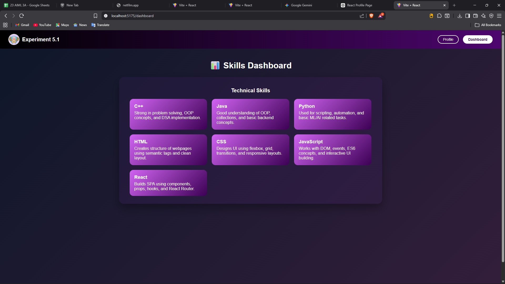
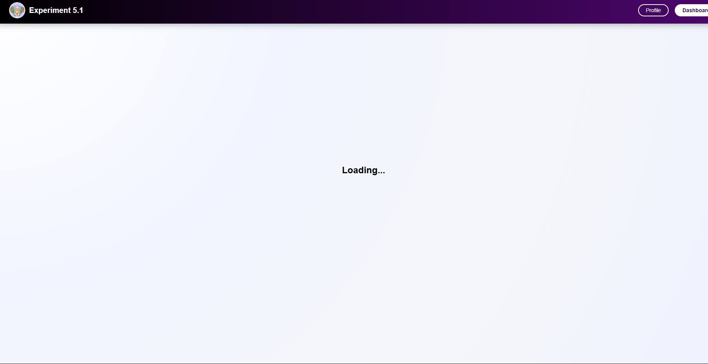

# React Lazy Loading SPA

This project is a Single Page Application (SPA) built with React and Vite, demonstrating the power of Code Splitting and Lazy Loading to optimize performance.

## 🚀 Features

-   **Lazy Loading**: The Dashboard component is lazily loaded using `React.lazy()` and `Suspense`, reducing the initial bundle size.
-   **Routing**: Implemented using `react-router-dom` for seamless navigation between pages.
-   **Suspense Fallback**: A custom loading UI is displayed while the lazy-loaded component is being fetched.
-   **Responsive Design**: basic structure ready for expansion.


## 🛠️ Technologies Used

-   [React](https://react.dev/) (v19)
-   [Vite](https://vitejs.dev/)
-   [React Router DOM](https://reactrouter.com/)

## 📦 Installation & Setup

1.  **Clone the repository** (if you haven't already):
    ```bash
    git clone <repository-url>
    ```

2.  **Navigate to the project directory**:
    ```bash
    cd multiSPA
    ```

3.  **Install dependencies**:
    ```bash
    npm install
    ```

4.  **Run the development server**:
    ```bash
    npm run dev
    ```

5.  **Open in Browser**:
    The app should be running at `http://localhost:5173` (or the port shown in your terminal).

## 📂 Project Structure

-   `src/App.jsx`: Main entry point handling routes and lazy loading.
-   `src/pages/`: Contains page components (`Profile`, `Dashboard`).
-   `src/components/`: Reusable components like `Navbar`.

## 🔍 How it Works

The `Dashboard` page is imported dynamically:

```javascript
const Dash = lazy(() => import("./pages/Dashboard"));
```

It is then rendered within a `Suspense` boundary:

```javascript
<Suspense fallback={<div className="loading-container">Loading...</div>}>
  <Routes>
    <Route path="/dashboard" element={<Dash />} />
    {/* ...other routes */}
  </Routes>
</Suspense>


