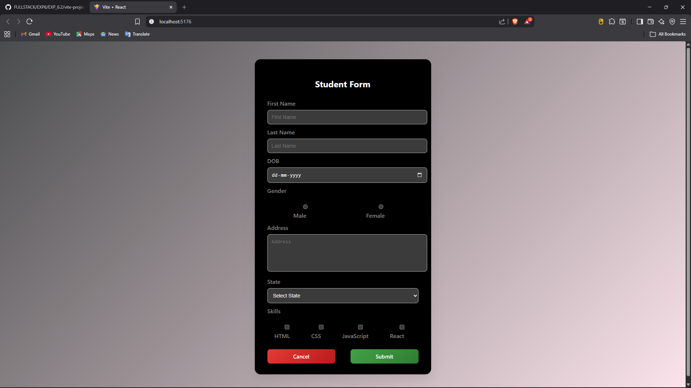
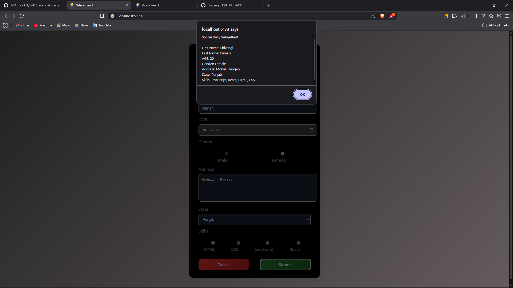

# Experiment 6.1 – Student Registration Form (React)

## 📌 Brief Description
This experiment demonstrates the implementation of a **controlled form in React**.  
The form collects user details such as name, date of birth, gender, address, state, and skills.  
All inputs are managed using React `useState` and displayed using an alert on submission.

---

## 📂 Files
- README.md  
- src/App.jsx  
- src/App.css  
- image1.png  
- image2.png  
- package.json  
- (other React project files)

---

## 🖼 Images
  


---

## ▶ How to Run

1. Install Node.js (if not already installed).
2. Open terminal in project folder.
3. Install dependencies:
   ```bash
   npm install