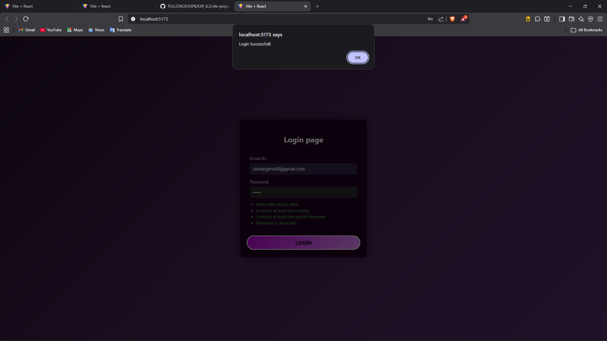

# Client-Side Form Validation (React + Vite)

This project is a **Login Page with Client-Side Form Validation** built using **React + Vite**.  
It validates user input in real-time for **Email ID** and **Password** based on given rules.

---

## 🚀 Features

### ✅ Email Validation
- Must contain exactly one `@`
- Must have a valid domain (example: `.com`, `.in`, `.org`)
- No invalid formats like:
  - `name..@gmail.com`
  - `name@@gmail.com`
  - `name@gmail`

---

### 🔐 Password Validation (Live)
Password must:
- Start with a **capital letter**
- Contain **at least one number**
- Contain **at least one special character**
- Have **minimum 5 characters**

Each rule turns **green** as soon as it is satisfied while typing.

---

## 🖥️ Tech Stack
- React (with Hooks)
- Vite
- CSS (custom styling)
- JavaScript (Regex validation)

---

## 📸 Screenshots

### 🔹 Login Page UI


### 🔹 Live Validation Example



---

## ⚙️ How to Run the Project

1. Clone the repository:
```bash
git clone <your-repo-link>